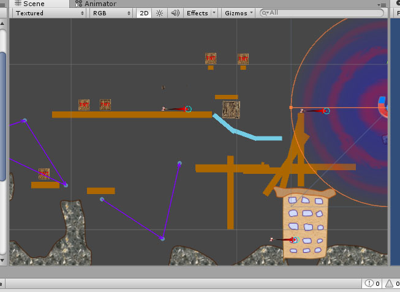
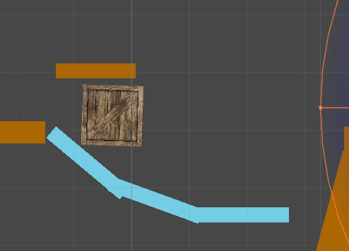
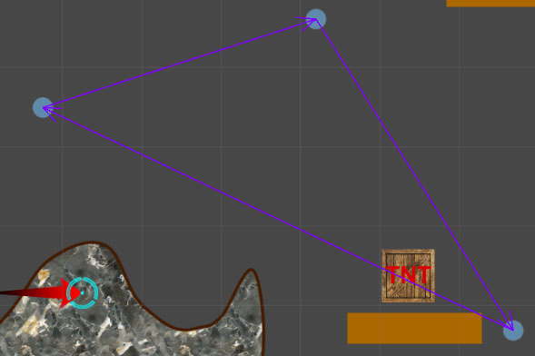
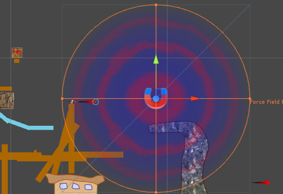

# Wyrms #

This game is an attempt to recreate Worms Armageddon gameplay
with addition of new physics features driven by PhysX.
Besides traditionally destructible terrain,
it features (or able to feature):
- Different friction on various walkable materials.
Some surfaces are icy, others are sticky.
- In addition to wind,
there are other kinds of physical effectors that influence trajectory of projectiles.
Magnets can draw metallic stuff like rockets,
local gravity anomalies can draw everything.
There can be even local anti-gravity effectors
that are pushing away everything that is close enough to the source of such force.
- Moving platforms are now possible.
- Tearing bridges between cliffs:
it's ok to walk over such bridge, but it will break once some unlucky worm falls on it.
- Everything else that PhysX can offer.

### How to play ###
- Open up the project in **Unity Editor**.
- Open `Sandbox.unity` scene file from the **Project Explorer** window.

#### Controls ####
| Action        | Key(s)            |
|---------------|-------------------|
| Jump          | Enter             |
| Backflip      | Backspace         |
| Fire          | Spacebar          |
| Walk          | Right/Left arrows |
| Aim           | Up/Down arrows    |
| Switch Weapon | Q                 |
| Next Worm     | N                 |

#### Gameplay ####
Sandbox contains some destructible environment
accompanied with a bunch of explosive TnTs scattered on the map.

There's an ice ramp near to the start location.

Some platforms are moving along the predefined paths,
they're here to help players travel from one cliff to another.

A large magnet can draw rockets, dynamite and bullets.

